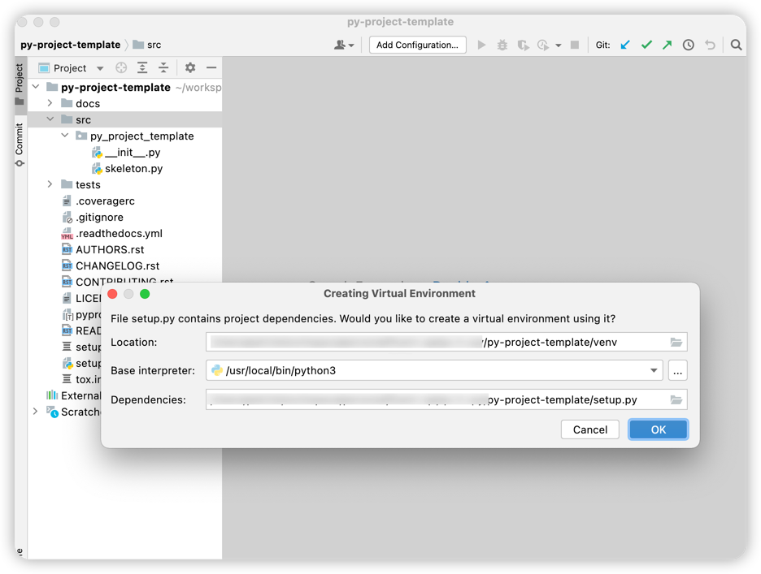

# Python Project Setup

- Install pyscaffold
- Use pyscaffold
- Use poetry

## 安装Pyscaffold

使用以下命令就可以安装pyscaffold
```shell
pip install --upgrade pyscaffold
```

## 建立第一个python项目

运行以下命令:
```shell
putup py-project-template
```
使用pycharm打开同时创建Python虚拟环境：


## 项目结构说明

- docs: 放置文档,可以自己修改使用什么写文档
- src: python源码位置
- tests:  放置测试代码
- venv: 虚拟环境

## Project Demo 