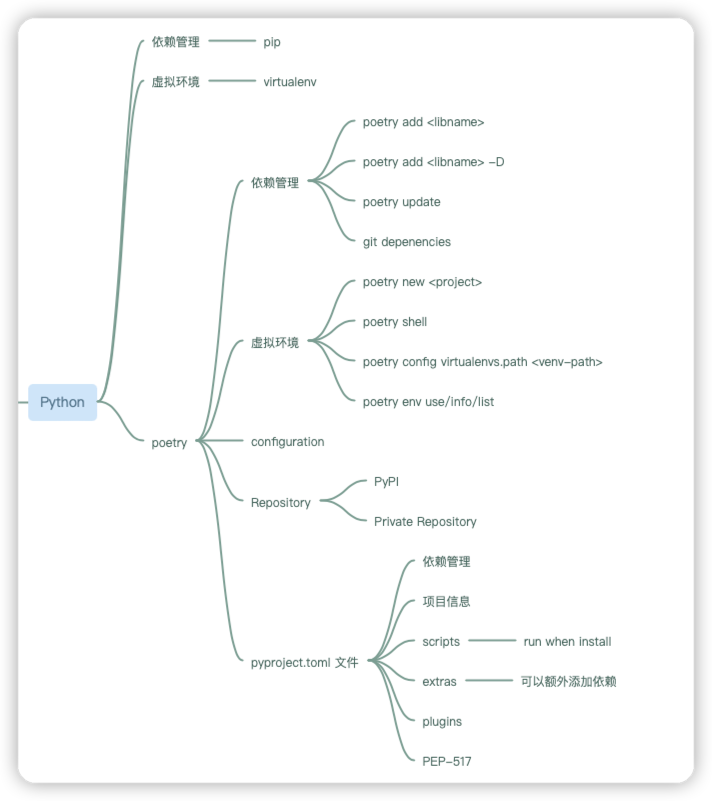

# Python Project Setup

软件越来越复杂,同时现代软件应用也不是完全的从头开始构建，一般都会利用
现有的开源软件开始构建，也就是软件的可组合性(composable),因此管理
软件应用的项目的依赖和构建是一个必备选项了.
使用Poetry来管理python项目的生命周期包括:
1. 虚拟管理
2. 第三方依赖管理
3. 第三方仓库
4. pyproject.toml文件



## 安装Poetry

使用以下命令就可以安装poetry
```shell
pip install --upgrade poetry
```
---
## 建立第一个python项目

运行以下命令:
```shell
poetry new pytodo
```
---
## 项目结构说明

- docs: 放置文档,可以自己修改使用什么写文档
- src: python源码位置
- tests:  放置测试代码
![project.png]

虚拟环境安装在默认的地址，可以使用如下命令查看：

```shell
poetry env info
```
---
## 安装第三方包依赖

- 安装dev-dependency
```shell
poetry add pytest -D
```
- 安装dependency
```shell
poetry add requests 
```
--- 

## 激活虚拟环境

```shell
poetry shell
```

---

## 其他