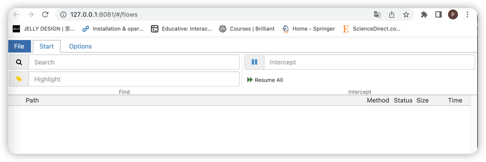

# mitmproxy Quick Start
- [mitmproxy-concept](https://ptorch.com/docs/10/mitmproxy-concepts-modes)
- [lyrebird](https://meituan-dianping.github.io/lyrebird/guide/)
- [exercism](https://exercism.org/)

## What is mimtproxy and where to use it

## Install mimtproxy

- 安装mimtprox,或者建立虚拟环境,进行安装mimtproxy
```shell
pip install mimtproxy
```
## mimmtproxy 启动命令

以下是mimtdump的启动命令:
```shell
mimtproxy
mimtdump
mimtweb
```
我们选择```mimtweb``` 来介绍mitmproxy的使用.
- 启动:
```shell
mimtweb
```


- 安装证书


## How to Use mimtproxy 

- 观察请求
- 修改请求
- 回放请求

## Advanced Usage