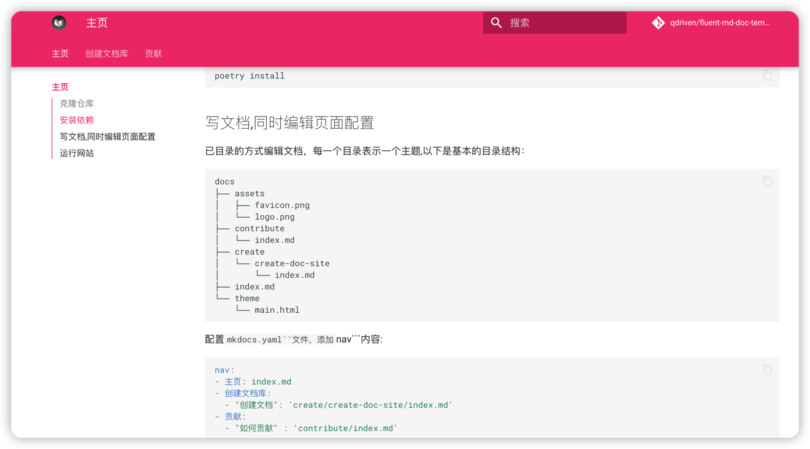

# Fluent-QA Mkdoc Template

这是fluent-qa 文档管理的一个基础版本.
如何使用这个仓库呢？可以分以下几步:

- 克隆仓库
- 安装依赖
- 写文档,同时编辑页面配置
- 部署到github

## 克隆仓库

```shell
git clone https://github.com/qdriven/fluent-md-doc-template.github
```

## 安装依赖

```shell
poetry install
```

## 写文档,同时编辑页面配置

已目录的方式编辑文档，每一个目录表示一个主题,以下是基本的目录结构：

```shell
docs
├── assets
│   ├── favicon.png
│   └── logo.png
├── contribute
│   └── index.md
├── create
│   └── create-doc-site
│       └── index.md
├── index.md
└── theme
    └── main.html

```

配置```mkdocs.yaml``文件，添加```nav```内容:

```yaml
nav:
- 主页: index.md
- 创建文档库:
  - "创建文档": 'create/create-doc-site/index.md'
- 贡献:
  - "如何贡献" : 'contribute/index.md'
```

## 运行网站

```shell
poetry run mkdocs serve
```


是不是非常简单，方便！